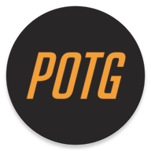

# PLAY OF THE GAME MEME - OVERWATCH FAN APP

## INTRODUCTION
- This is an meme generator app inspired by OVERWATCH PLAY OF THE GAME highlight scene. 
- You can make a highlight screenshot from your own photos and images.
- The quanlity of the generated image is based on the horizontal width of your device.

## DOWNLOAD
- install from [Google Play Store](https://play.google.com/store/apps/details?id=net.atlassc.playofthegamememe)
- install from [Cool Apk](https://www.coolapk.com/apk/159442)
   
## PRIVACY

### CAMERA USAGE
- This app uses camera to capture photos for you to make memes.

### INTERNET USAGE
- load this README file.
- load advertisement.
- send anonymous analytics to firebase.

### STORAGE USAGE AND BACK UP
- This app does not provide cloud storage function, and it will not back up your memes, please back up them with other apps like Google Photos or ONEDRIVE yourself.

### LOCATION USAGE
- One of Admob's requirements.

## ADVERTISEMENT
- This app is integrated with Google Admob to help its developer. Thanks for your supports.

## DEV ENV
- This app is developed on Nexus 6P (with Android 8.0 OREO most lately).
- Tested on the following Android emulators: 
    - Nexus 5X API 16
    - Nexus 5X API 18
    - Nexus 5 API 19
    - Nexus 5X API 22
    - Nexus 5X API 23
    - Nexus 5 API 24
    - Nexus 5 API 25
    - Nexus 6P API 26
- Due to limited budget, there are won't any more test device.

## CONTACT ME
shinchven#gmail.com

